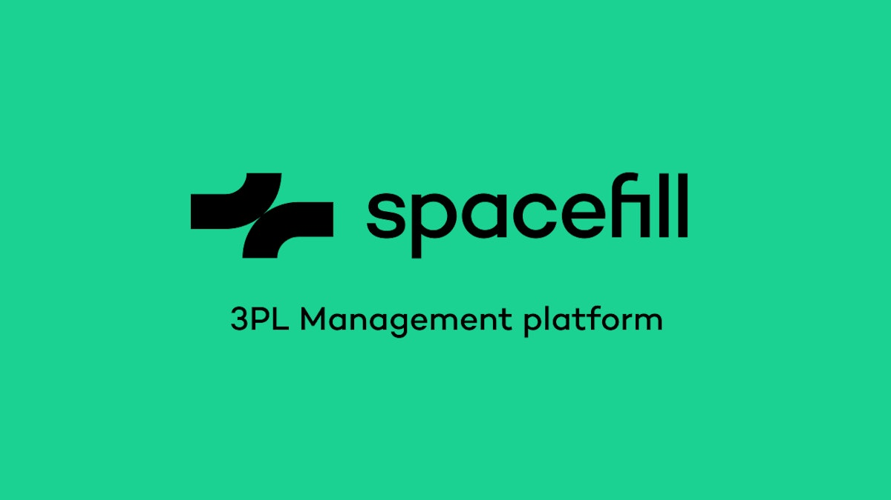

<div align="center">



# Spacefill Bootcamp — Boilerplate

### Construis tes propres outils internes avec Claude Code

**Décris une app en mots simples. Regarde-la se construire. Sans jamais écrire de code.**

<br />

[](https://nextjs.org)
[](https://react.dev)
[](https://supabase.com)
[](https://vercel.com)
[](#-quick-start)

</div>

---

## ✨ C'est quoi ?

C'est le kit de démarrage du **Spacefill Bootcamp**.

L'idée : les équipes Spacefill (Finance, Sales, Customer Success, Ops, Produit, Marketing) apprennent à construire leurs propres petits outils internes avec **Claude Code**, dans **VS Code**, et à les publier sur **Vercel**. Tu décris ton idée en langage de tous les jours à un assistant — et l'assistant construit **tout**. Tu n'écris, ne lis et ne touches jamais une ligne de code.

Ce dépôt est la **toile blanche** de départ. Tout est déjà branché pour que tu te concentres sur l'*idée*, pas sur la tuyauterie.

> **En une phrase : tu parles, l'app apparaît.**

---

## 🎯 Pourquoi ce boilerplate

Chaque minute passée à installer des outils, brancher une base de données ou configurer un framework est une minute volée à la construction. Ici, tout ce qui mange habituellement le temps est déjà fait :

- ✅ Framework, base de données et skills **pré-branchés** — `npm install && npm run dev` et c'est lancé.
- ✅ Une toile propre, **prête à construire**, pas un dossier vide à assembler.
- ✅ Le **playbook et les garde-fous** de l'assistant déjà en place : il construit vite et parle en mots simples dès le premier message.
- ✅ Des **vérifications Mac et Windows** (`/diagnostic-mac` et `/diagnostic-windows`) pour confirmer qu'une machine est prête *avant* la session.

Résultat : on ouvre le projet et on crée en **quelques minutes**, pas après une heure de configuration.

---

## 👥 Pour qui

| Tu es… | Ce que tu fais |
|---|---|
| 🧑‍💼 **Un·e participant·e Spacefill** | Décris ton idée en mots simples. C'est tout. |
| 🤝 **Un·e helper / organisateur·rice** | Vérifie que la machine est prête et débloque la technique. |
| 🛠️ **Un·e dev curieux·se** | Explore un starter minimal et moderne Next.js + Supabase. |

---

## 🚀 Démarrage rapide

```bash
npm install
npm run dev
```

Ouvre ensuite **<http://localhost:3000>**.

Tu verras une toile vide aux couleurs de Spacefill — c'est ton point de départ. Dis simplement à l'assistant ce que tu veux construire, par exemple :

> *« Construis-moi un mini outil pour suivre mes contacts. »*

…et ça apparaît juste là.

---

## ☁️ Déploiement sur Vercel

Quand tu veux partager ton app avec un lien public :

1. Pousse le projet sur ton dépôt GitHub.
2. Connecte le dépôt à **Vercel** (import du projet) — Vercel détecte Next.js automatiquement.
3. Récupère ton lien public et partage-le.

> **À savoir :** les données sont stockées dans **Supabase** (base de données hébergée). Pense à renseigner les deux valeurs de connexion Supabase dans les réglages de ton projet Vercel pour que l'app en ligne utilise la même base. L'assistant s'en occupe pour toi.

---

## 🧩 Ce qu'il y a dedans

Tout est déjà prêt — rien à configurer.

- ⚡ **Next.js 16 + React 19** (App Router) — le framework web moderne qui propulse l'app.
- 💾 **Base de données Supabase intégrée** — tout ce que ton app doit retenir est sauvegardé automatiquement et reste disponible en ligne. Connexion gérée dans `lib/supabase.js`. L'assistant branche tout pour toi.
- 🎨 **Une page d'accueil propre** (`app/page.js`) — ta toile de départ, remplacée par ce que tu construis.
- 🧠 **Des skills de projet** qui voyagent avec le dossier (`.claude/skills`) :
  - **`/givemeideas`** — un menu d'idées d'app pour démarrer (puise dans les vraies idées du bootcamp).
  - **`/spacefill-ui-design`** — style toute interface aux couleurs de la charte Spacefill.
  - **`/diagnostic-mac`** — vérification technique de préparation pour les Mac.
  - **`/diagnostic-windows`** — vérification technique de préparation pour les PC Windows.
  - **`/kickoff`** — prépare, vérifie, lance et prévisualise le starter pour la personne.
  - **`/capture-bug`** — aide à décrire un problème pas à pas pour le corriger ensuite.
- 📋 **`AGENTS.md`** — le playbook complet que suit l'assistant pour parler en mots simples et construire vite.

Tu n'as jamais besoin de toucher à tout ça.

---

## 💡 Des idées pour démarrer

Pas sûr·e de quoi construire ? Tape **`/givemeideas`** dans l'assistant, ou inspire-toi :

1. **🗂️ Mini CRM personnel** — centralise tes contacts et suis tes opportunités.
2. **📊 Cockpit de suivi clients** — repère tôt les clients à risque ou en baisse d'usage.
3. **🔍 Annuaire d'expertise interne** — retrouve vite la bonne personne dans l'équipe.
4. **📝 Générateur de propositions** — produis des propositions commerciales structurées automatiquement.

> Les idées soumises par les équipes Spacefill vivent dans `.claude/context/idees-projets-bootcamp.json`.

---

## 🛠️ Comment ça marche (en coulisses)

```
Tu décris une idée  →  L'assistant la construit  →  Ça s'affiche  →  « Et ensuite ? »
```

- L'assistant tourne en boucle **Écouter → Construire → Montrer → Demander la suite**, en affichant vite quelque chose, puis en l'améliorant.
- Il parle **en mots simples** — pas de jargon — et corrige ce qui casse sans te renvoyer d'erreur.
- Les données sont sauvegardées **silencieusement dans Supabase**. Si ton app doit retenir quelque chose, elle le retient — en local comme en ligne.

---

## 🧰 Commandes utiles (pour les helpers)

| Commande | Ce que ça fait |
|---|---|
| `npm install` | Installe tout ce dont le projet a besoin. |
| `npm run dev` | Lance l'app sur `http://localhost:3000`. |
| `npm run build` | Vérifie que toute l'app compile. |
| `npm run lint` | Vérifie la qualité du code. |
| `npm run preflight` | Lance lint **et** build ensemble — le contrôle de préparation. |

---

## 📁 Structure du projet

```
.
├── app/                 # L'app web (pages, layout, styles)
│   ├── page.js          # La toile d'accueil
│   ├── layout.js        # La coquille partagée des pages
│   └── globals.css      # Le style
├── lib/
│   └── supabase.js      # Connexion à la base de données (la mémoire de ton app)
├── .claude/
│   ├── skills/          # /givemeideas, /spacefill-ui-design, /diagnostic-*, /kickoff…
│   └── context/         # Contexte du bootcamp (idées, cadrage, notes setup)
├── public/              # Images et fichiers statiques (logo Spacefill)
├── .env.example         # Modèle pour tes clés Supabase (copier en .env.local)
└── AGENTS.md            # Le playbook complet de l'assistant
```

---

<div align="center">

**Spacefill · Bootcamp Claude Code**

*Fait pour les gens qui ont de bonnes idées et pas le temps de coder.*

</div>
